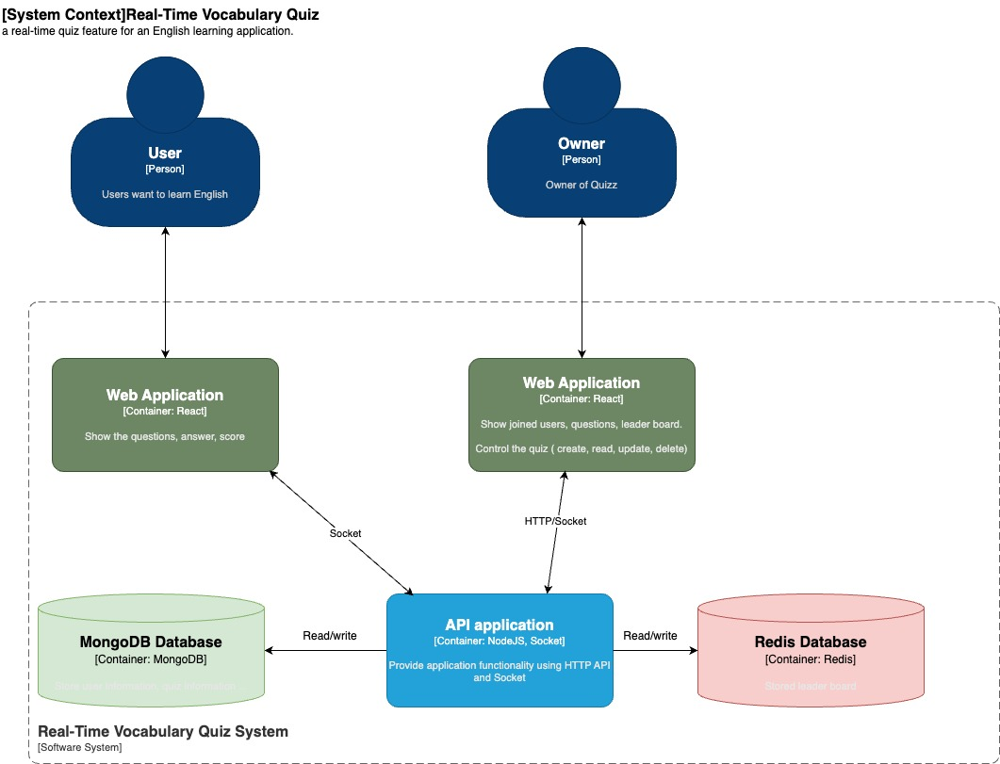
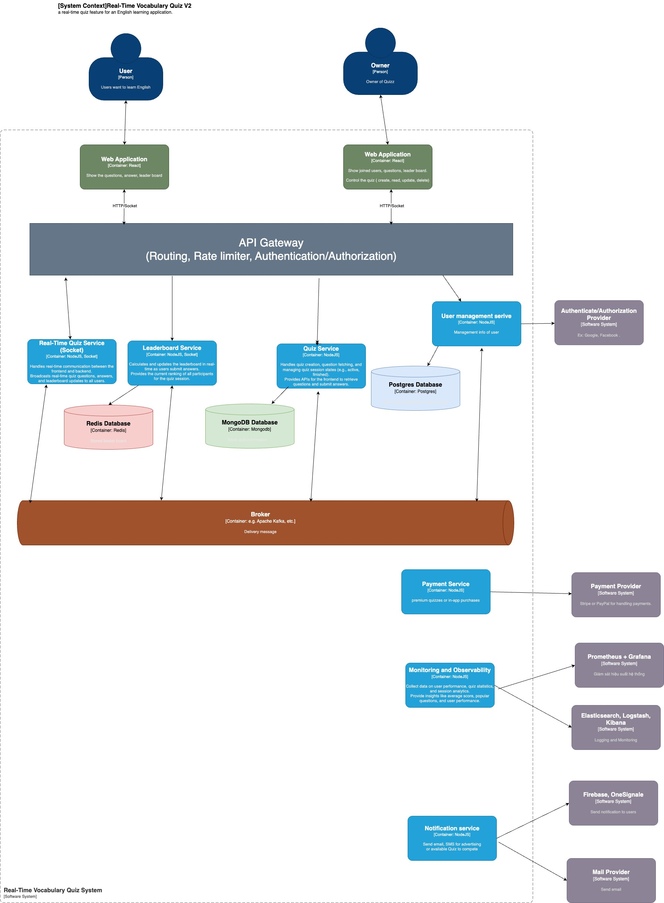
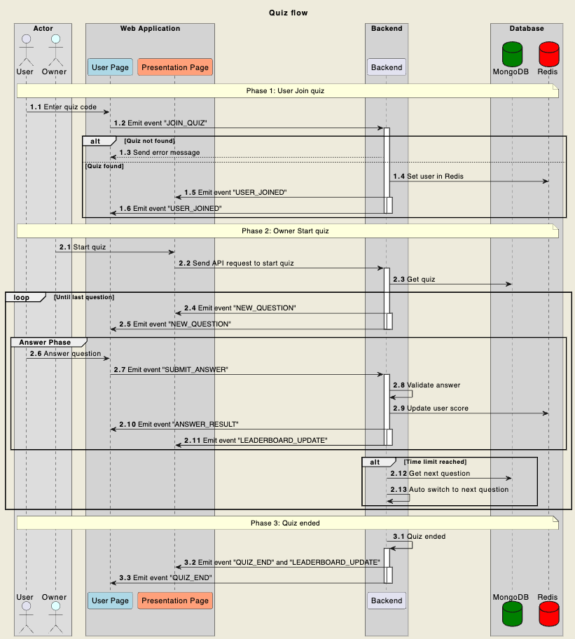

# Real-Time Vocabulary Quiz Coding Challenge

## Overview

Welcome to the Real-Time Quiz coding challenge! Your task is to create a technical solution for a real-time quiz feature for an English learning application. This feature will allow users to answer questions in real-time, compete with others, and see their scores updated live on a leaderboard.

## Features

1. **User Participation**:

   - Users should be able to join a quiz session using a unique quiz ID.
   - The system should support multiple users joining the same quiz session simultaneously.

2. **Real-Time Score Updates**:

   - As users submit answers, their scores should be updated in real-time.
   - The scoring system must be accurate and consistent.

3. **Real-Time Leaderboard**:
   - A leaderboard should display the current standings of all participants.
   - The leaderboard should update promptly as scores change.

## System Design

[Link video demo](https://drive.google.com/drive/folders/1Gyx2JKdQ-CpcGoU7ReZRMHSgsW08urEw?usp=sharing)

### Architecture Overview V1

### Architecture Overview V2 (Upgrade version)

### Quiz flow

